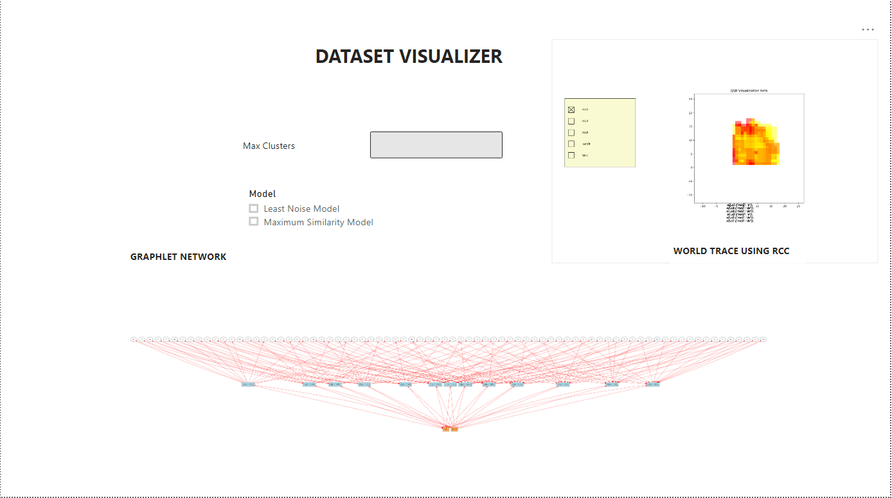
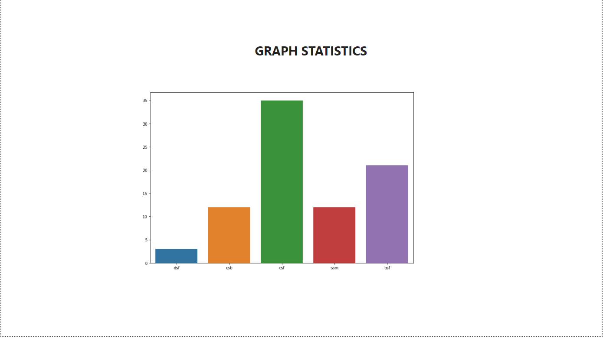

# Power BI App for Visualizing Dataset behaviour

In this project, a power bi based visualization app is proposed to analysing the neighborhood of the dataset using Quality Spatial Relations (QSR). Two datasets have been used to be analysed under Monte Carlo Tree Search (MCTS) and other popular Machine Learning algorithms. MCTS uses a UCB (Upper Confidence Bound) based reward system that is relevant to simulate within the state space of every dataset. 

## Multi-armed bandit frameworks

In a multi-armed bandit framework, a person simulates the environment by taking actions from a multi-labeled data source. The reward tree structure considers two approaches that have been documented based on:

- Least Noise model, in the case of Factor Analysis
- Maximum Similarity model, in the case of Latent Semantic Analysis

